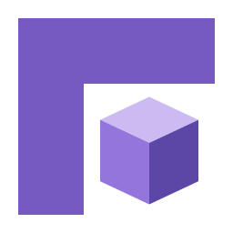

<p align="center">
  
</p>

<h1 align="center">Forge</h1>

<p align="center">
  <b>An AI coding partner for VS Code, built on Claude Code.</b><br>
  Same engine. Your models, your agents, your rules.
</p>

<p align="center">
  
</p>

---

## Why Forge?

Claude Code is one of the best coding agents there is. But it's built around
Anthropic's models and one general-purpose assistant.

**Forge keeps the engine and changes the rest:**

| You want to… | Forge gives you |
| --- | --- |
| use your company gateway, vLLM or Ollama | **Endpoint profiles**: any OpenAI- or Anthropic-compatible model |
| have a release agent that can only touch the changelog | **Hermes agents**: personas scoped to the tools they need |
| let small local models do real work | **Guards** that repair their tool calls and stop them looping |
| keep `rm` and `git push --force` on a leash | **A risk check** that asks before anything destructive |

---

## How Forge is built on top of Claude

Forge doesn't imitate Claude Code. It **runs** it.

```
  +----------------------------------------------+
  |  Forge UI      Claude Code's own interface,  |  <- what you see
  |                in Forge purple               |
  +----------------------------------------------+
  |  Forge host    endpoints, agents, guards,    |  <- what Forge adds
  |                risk check, CLI flag gate     |
  +----------------------------------------------+
  |  Claude Agent SDK                            |  <- the official bridge
  +----------------------------------------------+
  |  claude CLI    the real binary, bundled      |  <- the engine
  +----------------------------------------------+
```

1. **The engine is the real `claude` binary.** It ships inside Forge and runs
   through Anthropic's official Agent SDK. Tools, skills, hooks, MCP, `CLAUDE.md`
   and permissions all work the way they do in Claude Code.
2. **The interface follows Claude Code's.** The chat, menus, permission prompt
   and past conversations are built from the official extension's layout, so
   it already feels familiar.
3. **Forge adds a layer in between.** Before a request reaches the CLI, Forge
   can send it to another model, give it an agent's persona and limits, check
   it for risk, or fix a small model's broken tool call.

Anything the CLI learns to do, Forge can do too.

---

## Get started in 3 steps

**1. Install and open.** Click the **Forge mark** in the activity bar, or press
`Ctrl+Esc` (`Cmd+Esc` on macOS).

**2. Sign in once.** Forge uses the same sign-in as Claude Code: if you've
signed in to Claude Code on this machine, you're done. Otherwise, pick one:
- sign in with `/login` in Claude Code in a terminal;
- set `ANTHROPIC_API_KEY` in `forge.environmentVariables`;
- skip Anthropic entirely with an endpoint profile ([step 3 below](#bring-your-own-model)).

**3. Ask.** Type a task and press Enter. Use `@` to pull in files, or press
`Alt+K` to mention the file you're in (with its selected lines).

> **Tip:** Forge asks before it edits files or runs commands. Watch each edit
> land beside the chat as it happens (`forge.followEdits`, on by default).

---

## What you can do

<table>
<tr><td width="50%" valign="top">

**💬 Chat with your codebase**<br>
Explain, fix, refactor, write tests, and run commands, all streamed live.

**🕘 Pick up where you left off**<br>
Every conversation is saved. Reopen, rename or fork one, or rewind its file
changes.

**🧠 Control how hard it thinks**<br>
Choose the model and the effort level, and turn extended thinking on or off.

</td><td width="50%" valign="top">

**🔌 Extend it**<br>
Create skills, slash commands, subagents and MCP servers from the Command
Palette (**Forge: Create…**).

**🌿 Work in parallel**<br>
**Forge: Create Worktree** gives a task its own git worktree. **Open in New
Tab** runs several conversations side by side.

**🛡️ Stay in control**<br>
Choose a permission mode: Manual, Edit automatically, or Plan.

</td></tr>
</table>

---

## Bring your own model

Point Forge at any OpenAI- or Anthropic-compatible endpoint: a company
gateway, a self-hosted vLLM or Ollama server, or an air-gapped deployment.

Run **Forge: Add Endpoint Profile**, or write the profile yourself:

```jsonc
"forge.endpoints": {
  "company-llama": {
    "wire": "openai",
    "baseUrl": "https://llm.internal.example/v1",
    "model": "llama-3.3-70b-instruct",
    "auth": { "kind": "bearer", "value": "${secret:COMPANY_TOKEN}" }
  }
},
"forge.endpointProfile": "company-llama"
```

- **Secrets stay out of `settings.json`.** Write `${secret:…}` (the OS
  keychain), `${env:…}` or `${file:…}` instead.
- **Corporate networks are covered:** client certificates, custom CA bundles,
  authenticating proxies and token exchange.
- **Check a profile before you rely on it.** **Run Endpoint Diagnostics**,
  **Detect Endpoint Capabilities** and **List Endpoint Models** show what an
  endpoint can really do.
- **Small models get guard rails.** Forge repairs misspelled tools and malformed
  arguments, notices when a server cuts the prompt short, and stops repeated
  calls.

---

## Hermes agents

An agent is **one Markdown file** in `.forge/agents/`: a persona plus a list of
what it may reach.

```markdown
---
name: release
description: Prepares releases. Touches the changelog, nothing else.
tools: [read_file, search, glob]
mcp:
  github:
    tools:
      include: [list_issues, create_issue]
---

You are the release manager. Summarise merged work into CHANGELOG.md…
```

Anything you leave out is unrestricted, so start with a persona and add limits
later. Switch agents with **Forge: Select Agent**, or bind one to a model with
`forge.agentEndpoints`.

**Why scope?** Every tool a model can see costs context on every request, and
it's one more tool the model might call by mistake. A narrow agent is cheaper
and safer.

---

## Safety, by default

- **Destructive commands always ask**, even in Edit automatically: `rm`, `mv`,
  `git clean`, and anything that rewrites or pushes git history.
- **Optionally auto-approve the harmless ones** (reads, searches, `git diff`)
  with `forge.autoApproveSafeCommands`.
- **Untrusted folders are off-limits.** Claude Code loads a folder's hooks and
  MCP servers when it starts, so Forge waits until you trust the folder.
- **Flags are gated.** `forge.cliArgs` passes any `claude` flag through, except
  the ones that would break Forge's connection to the CLI.

---

## Key settings

| Setting | What it does |
| --- | --- |
| `forge.endpointProfile` | Which endpoint to use (empty = Anthropic) |
| `forge.activeAgent` | Which Hermes agent Forge runs as |
| `forge.selectedModel` | The model for new sessions |
| `forge.preferredLocation` | Open the chat in a tab (`panel`) or the sidebar |
| `forge.followEdits` | Show each edit as it happens |
| `forge.autoApproveSafeCommands` | Run commands the risk check finds harmless without asking |
| `forge.cliArgs` | Extra flags for the `claude` CLI |

All settings: **Forge: Open Settings**. Having trouble? **Forge: Run CLI Doctor**
and **Forge: Show Logs**.

---

## Requirements

- VS Code **1.98** or newer
- **Windows x64** or **Linux x64** (glibc). The Claude Code binary for both is
  bundled, so there's nothing else to install.
- A Claude sign-in, an Anthropic API key, or an endpoint profile

---

## Credits

Forge started as a fork of [Claudix](https://github.com/Haleclipse/Claudix) by
Haleclipse and runs Anthropic's Claude Code CLI and Agent SDK. Its interface
follows Anthropic's official Claude Code extension, recoloured in GitLab's
[Pajamas](https://design.gitlab.com/) design system.

Forge is an independent project, **not made or endorsed by Anthropic**.
It is licensed **AGPL-3.0**. Contributors: see [docs/DEVELOPMENT.md](docs/DEVELOPMENT.md).
